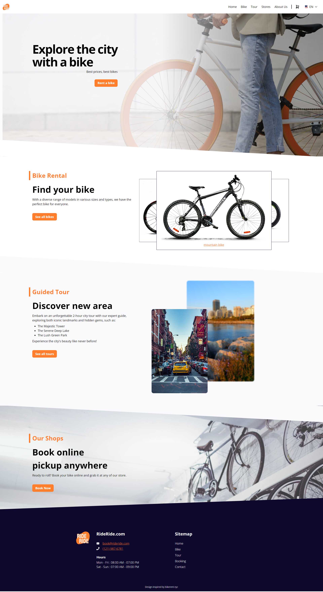

# Ride Ride

Made with

## About

This is a toy project for learning how to use Storybook, React.Js, and i18next.
The website is about a fictional bicycle rental shop that offers bikes and tours across the city.

## Downfall

While this project went well in the beginning. It started going downhill when I tried implementing features without a clear design backing it up. The form features is also still a mess because, the business process of the fictional bike shop isn't clear enough. I don't how a bike rental shop operates and how the booking works, so the booking form in this project reflected that.

## Learning Points

What I learned from this project:

- Create the design first (or create at least the smaller reusable components like input and select field)
- Plan the business process first, so the form isn't a mess

## Screenshot

